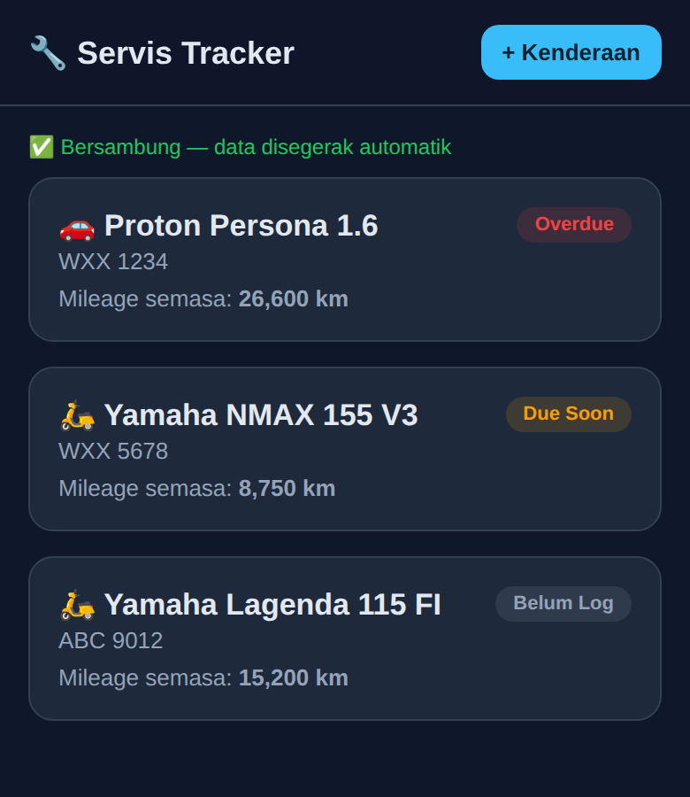
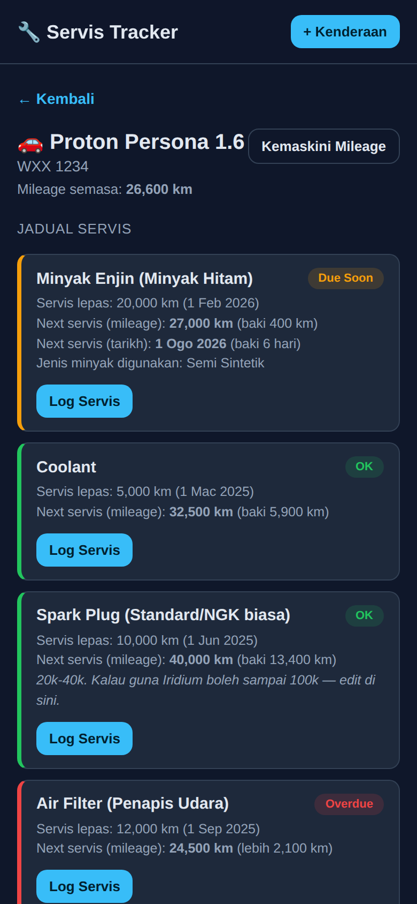
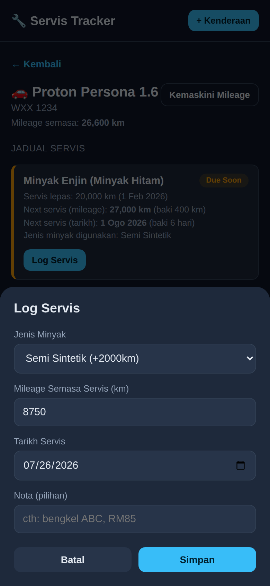

# 🔧 Servis Tracker

**Track your vehicle's oil changes and maintenance — never miss a service again.**

A free, open-source, installable web app (PWA) for tracking engine oil and maintenance schedules for your car and motorcycles. Register your vehicles, log each service, and let the app automatically calculate when the next one is due — based on mileage *and* time, whichever comes first.

Built for personal use (originally for a Proton Persona 1.6, a Yamaha NMAX 155, and a Yamaha Lagenda 115 FI), but fully customizable for any vehicle.

---

## ✨ Features

- **Multi-vehicle dashboard** — track as many cars/motorcycles as you want, each with its own maintenance schedule. Presets included for cars/motorcycles, plus a fully custom option (and two just-for-fun types — Helicopter 🚁 and Bicycle 🚲 — for anyone whose vehicle doesn't fit any category).
- **Smart oil-change tracking** — pick semi-synthetic or fully-synthetic at each service, and the app auto-calculates the correct next-due mileage for that oil type.
- **Full maintenance coverage** — engine oil, coolant, spark plugs, CVT belt/set, air filter, brake fluid, battery, plus any custom item you want to add (modifications, extra parts, anything).
- **Mileage + time based due dates** — some items are due by km, some by months, some by both. The app flags whichever comes first.
- **Color-coded status** — instantly see what's OK (green), due soon (yellow), or overdue (red) for every vehicle.
- **Optional vehicle name, plate, and photo** — give each vehicle a nickname, skip the registration plate if you don't want to enter it, and attach a photo (auto-compressed client-side so it fits Firestore's size limits — no separate storage setup needed).
- **Optional roadtax expiry tracking** — see at a glance whether your roadtax is OK, due soon, or overdue. Purely visual, no automatic notifications.
- **Optional driving license (lesen memandu) tracking** — log one or more license classes from the official JPJ class list, each with its own expiry date. Fully optional and doesn't block core service tracking.
- **Access from anywhere, on any device** — sign in with your Google account and your data follows you across phone, laptop, tablet, anywhere with internet.
- **Per-account data isolation** — every vehicle is scoped to your Google account (`ownerId`) and enforced by Firestore Security Rules, so if you deploy this for a group, nobody can see or edit anyone else's vehicles.
- **Installable on iPhone & Android** — add it to your home screen and it behaves like a native app, no browser chrome, works offline for viewing.
- **No backend server to maintain** — just static files + a free Firebase project. Hosted for free on GitHub Pages.
- **Your data, your project** — every user deploys their own copy with their own Firebase project.

---

## 📱 Preview

| Dashboard | Vehicle Detail | Log a Service |
|---|---|---|
|  |  |  |

> These are sample screenshots with demo data. Swap them out with your own once you've set up your vehicles — just drop new images into `screenshots/` with the same filenames.

---

## 🧰 Tech Stack

- Vanilla HTML / CSS / JavaScript (no framework, no build step)
- [Firebase Firestore](https://firebase.google.com/products/firestore) — real-time cloud database (free tier)
- [Firebase Authentication](https://firebase.google.com/products/auth) (Google Sign-In) — real per-account identity, syncs across devices
- [GitHub Pages](https://pages.github.com/) — free static hosting
- Web App Manifest + Service Worker — installable, app-like experience on iOS & Android

Total cost to run: **$0**, within Firebase's free (Spark) tier for personal use.

---

## 🚀 Deploy Your Own Copy

This project is designed so **everyone runs their own independent instance** — your maintenance data is private to you, stored in your own Firebase project.

1. **Fork this repository** (top-right "Fork" button on GitHub).
2. Follow **[SETUP_GUIDE.md](./SETUP_GUIDE.md)** — a full step-by-step walkthrough (~20-25 minutes) covering:
   - Creating a free Firebase project
   - Enabling Firestore + Google Sign-In
   - Adding your GitHub Pages domain to Firebase's authorized domains
   - Setting security rules so each account can only read/write its own vehicles
   - Creating the one Firestore composite index the app needs
   - Deploying to GitHub Pages
   - Installing the app on your iPhone/Android home screen
3. Open your new URL, sign in with Google, register your vehicles, and start logging services.

No coding experience required — it's mostly clicking through Firebase Console and GitHub settings.

---

## 🛠️ Customizing for Your Own Vehicles

All maintenance intervals live in one file: **[`schedules.js`](./schedules.js)**. Each vehicle type is a plain JavaScript object listing its service items and intervals (in km and/or months). To add your own vehicle model or change an interval:

```js
mycustomvehicle: {
  label: "Honda Civic 1.5 Turbo",
  vehicleClass: "car",
  icon: "🚗",
  items: {
    engine_oil: {
      label: "Engine Oil",
      hasOilType: true,
      oilTypes: {
        semi:  { label: "Semi-Synthetic", km: 7000, months: 6 },
        fully: { label: "Fully Synthetic", km: 10000, months: 6 }
      }
    },
    coolant: { label: "Coolant", km: 40000, months: null },
    // ...add more items as needed
  }
}
```

Add your new object to `VEHICLE_TYPES` and it instantly shows up in the "+ Kenderaan / + Vehicle" dropdown — no other code changes needed.

---

## 🗺️ Roadmap / Ideas

Not built yet, but reasonable next steps if you want to extend it:

- Push/email/Telegram/WhatsApp reminders when a service is due soon
- Service cost tracking / spending history
- Export service history to PDF or CSV
- Photo attachments per service log entry (receipts, parts) — separate from the vehicle photo already supported

---

## 🤝 Contributing

This started as a personal project, but pull requests are welcome — bug fixes, new vehicle presets, translations, UI polish, etc. Open an issue first if you're planning a larger change.

---

## 📄 License

Released under the [MIT License](./LICENSE) — free to use, modify, and deploy for personal or commercial purposes.

---

## 🙏 Credits

Built by [Safwan](https://github.com/) with help from Claude. Maintenance intervals are general rule-of-thumb figures for personal reference — always double-check against your vehicle's owner manual or workshop advice for anything safety-critical (brakes, tires, etc).
